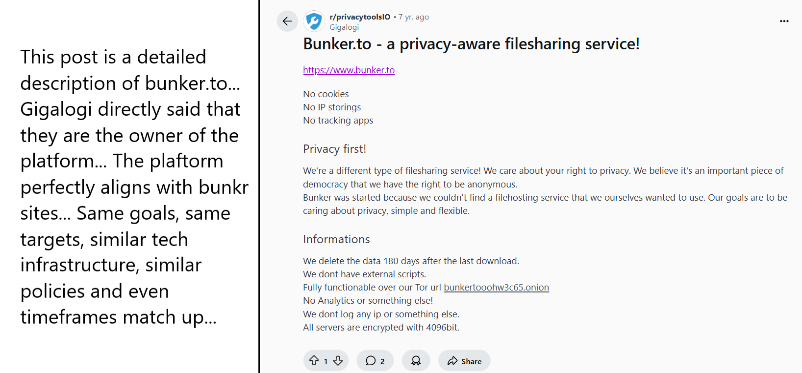

# OSINT Report: Attribution Analysis of the Bunkr File Hosting Network

## Summary

This report details the investigation into the **Bunkr file-hosting network**, a decentralized system that enables large-scale anonymous distribution of pirated and NSFW material. Through infrastructure analysis and behavioral profiling, this investigation strongly suggests that the operator behind Bunkr is linked to an earlier project, **bunker.to** and an online identity known as **"gigalogi"** and that Bunker LLC in Sweden is behind the operations of bunkr.

  

---

## 1. Bunkr Infrastructure & Technical Strategy

### Domains Analyzed:
- **Core Domain**: `bunkr.cr`
- **Secondary/Passive Domains**: `bunkr.si`, `bunkr.site`, `bunkr.black`, `bunkr.ac`, etc.

### Key Findings:

#### `bunkr.cr` – Likely the **origin server**:
- Self-hosted mail system (no third-party relay)
- Suggests centralized internal operations or privileged services
- Unlike other domains, Cloudflare not used.

#### `bunkr.si` – Likely a **staging or passive asset**:
- No MX or SPF records
- Still under Cloudflare - may serve as a fallback or redirect

#### Other Domains (e.g. `bunkr.site`, `bunkr.ac`):
- Use **Mailgun** with unique tokens per domain
- SPF records resolve to the same sending IP: `91.149.226.35`
- DNS managed centrally via Cloudflare

---

### Infrastructure Strategy

This setup is not generic or accidental. It’s built with deliberate intent to:

- Distribute control across multiple domains
- Prevent metadata or token leaks across services
- Evade DMCA takedowns and increase legal resilience
- Optimize privacy and anonymity (e.g., no user login required, no analytics, TOR mirror)

This architecture reflects techniques often seen in **illicit hosting operations** especially tied to NSFW and piracy, not mainstream platforms.

---

## 2. Conclusion

The Bunkr network exhibits **deliberate decentralization and operational security**, clearly tailored to **facilitate high-risk content distribution** like pirated media and NSFW materials.

This level of planning implies:
- Years of experience in underground hosting operations
- Fluency with DNS isolation, privacy-first UX design and infrastructure segmentation
- Familiarity with seedboxes, privacy tooling, piracy communities and DMCA evasion

A builder of such a system would almost certainly have a history in:
- `r/seedboxes`, `r/datahoarder`, `r/piracy`
- NSFW content forums and Discord servers
- `r/privacy` and `r/privacytoolsIO`

---

## 3. Attribution: Redditor **"gigalogi"**

Alias: `u/gigalogi`  
Activity: 9+ years on Reddit  
Involvement:
- Directly promoted **bunker.to**, a file-sharing service aligned with Bunkr
- Consistently active in piracy, NSFW and seedbox communities
- Probably european; frequently posts in european subreddits or uses european platforms and tools
- Writes in broken English, consistent with a non-native speaker
- Promoted privacy-first hosting and decentralized file-sharing systems

---

## 4. Why "gigalogi" Is a Viable Suspect

| Evidence | Relevance |
|----------|-----------|
| Personally promoted **bunker.to** | Clear operator or core team member |
| Consistently aligned with Bunkr’s purpose | Piracy, NSFW, anonymous file distribution |
| Advocated for anonymous hosting and TOR | Matches Bunkr’s infrastructure strategy |
| Active in seedbox and traffic optimization threads | Deep understanding of backend content delivery |
| European and non-native english speaker | Matches registration location of **Bunker LLC (Malmö, Sweden)** |
| Never used alias outside Reddit | Indicates high OPSEC discipline - further suggesting intent |

This isn’t a casual promoter - it's a technical operator with aligned skills, values and timing.

---

## 5. From **bunker.to** to **bunkr.*:** Rebranding Evidence

Bunker.to (2017–2019):
- No user tracking
- No analytics
- Build to target customers for direct NSFW and piracy usage
- Directly promoted for NSFW storing and sharing
- Encrypted file storage
- Fully accessible via .onion
- "No IP storing", "Privacy first" - same slogans found in Bunkr

Bunkr.* (2020+):
- Uses same privacy-first language and model
- Expanded multi-domain strategy
- Same user targets- piracy, NSFW
- Directly promoted NSFW content storing as well
- Same TOR-accessible model
- More sophisticated infrastructure with increased resilience

This is not a copy - it is an **evolution**.

---

## 6. Timeline Alignment

| Year | Event |
|------|-------|
| 2017 | bunker.to is launched and developed by **Bunker LLC** registered in Malmö, Sweden |
| 2017 | `gigalogi` promotes bunker.to across Reddit (seedboxes, piracy, NSFW) |
| 2019 | bunker.to goes inactive |
| Early 2020 | bunker.to disappears completely |
| Late 2020 | First `bunkr.*` domains surface (e.g. `bunkr.cr`) |
| 2021–2025 | `bunkr` gains rapid traction in piracy and NSFW ecosystems |

This timing suggests **bunkr was launched as a strategic rebrand** of `bunker.to`.

> **Evidence Screenshots**:  
> 
> 
> 

> **More Promos of Bunker.to in other spaces**: 
> 
> 

---

## 7. Bunker LLC (Sweden) - Legal Tie-In

- `bunker.to` was explicitly promoted as a project of **Bunker LLC**, a Swedish company registered in Malmö
- Gigalogi publicly states that "Bunker LLC" is behind the project
- No other known hosting products associated with the LLC - strongly implies continuity into `bunkr`

> **Evidence Screenshot**:
> 

This entity can now be used as the legal basis for pursuing deeper records, court orders or infrastructure takedowns.

---

## Final Verdict

All evidence - technical, behavioral, linguistic and historical - converges on the conclusion that:

- **Bunkr is a rebranded successor of bunker.to**
- The Reddit user `gigalogi` is **highly likely the founder or a core member**
- **Bunker LLC (Malmö, Sweden)** is the legal entity responsible

> **This report establishes a strong attribution hypothesis** for use by legal entities, cybersecurity teams or enforcement agencies to take further action.

---

## 📎 Appendix (Available in `/docs/`)

- WHOIS records
- DNS & SPF mapping
- Archived Reddit posts by `gigalogi`
- Screenshots of `bunker.to` promo posts
